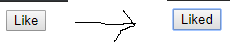
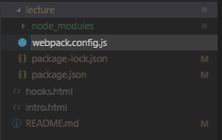
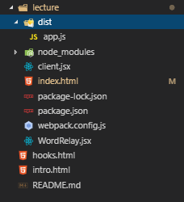

# React-webgame
<u>제로초님 리액트 기초 웹게임 강좌</u>


- [리액트 시작하기](#setup)
- [리액트 반복문](#repeat)
- [컴포넌트 렌더링](#componentUpdate)
- [라이프사이클](#lifeCycle)
- [로또추첨기](#lotto)
- [로또추첨기 - hooks](#lotto_hooks)
- [틱택토](#tictactoe)


<a name="setup"></a>

## 첫 번째 리액트 컴포넌트 생성

```
<!DOCTYPE html>
<html lang="en">
<head>
    <meta charset="UTF-8">
    <meta name="viewport" content="width=device-width, initial-scale=1.0">
    <meta http-equiv="X-UA-Compatible" content="ie=edge">
    <title>first React</title>
    <script crossorigin src="https://unpkg.com/react@16/umd/react.development.js"></script>
    <script crossorigin src="https://unpkg.com/react-dom@16/umd/react-dom.development.js"></script>
</head>
<body>
    <div id="root"></div>

    <script>
        const e = React.createElement;

        // 실행 계획
        class LikeButton extends React.Component {
            constructor(props) {
                super(props);
                this.state = {
                    liked: false,
                }
            }

            render() {
                return e(
                    'button',
                    { onClick: () => {this.setState({ liked: true})} , type: 'submit'}, 
                    this.state.liked === true ? 'Liked' : 'Like',
                );
            }
        }
    </script>

    <script>
        // 실행
        ReactDOM.render(e(LikeButton), document.querySelector('#root'));
    </script>
</body>
</html>
```

## 결과



- 리액트는 프레임워크 같은 라이브러리다.
- CDN 으로 리액트를 바로 사용할 수 있다.


## JSX 와 babel

- 리액트를 사용하기 위해서는 JSX 문법을 사용해야 한다.
- JSX 는 브라우저에서 읽을 수 없으므로 babel 을 통해 자바스크립트 문법으로 변환 후 렌더링 해야한다.


## npm 초기화
- 설치하려는 폴더에서 터미널 실행 (node, npm 이 설치 되어있어야 한다.)

```
npm init
```

- 기재부분 : author, license
- 설치 후 package.json 생김.

## 리엑트 & 리액트 DOM 설치

```
npm i react react-dom
```

## 웹팩 설치하기

```
npm i -D webpack webpack-cli
```

- 여기서 -D 는 개발할 때만 쓰겠다는 것.

## 웹팩 & 리액트 설정 파일 생성

- webpack-config.js



```
module.exports = {
    
};
```

## 웹펙을 빌드 결과를 저장할 경로 설정



- client.jsx


```
const React = require('react');
const ReactDom = require('react-dom');
```

- index.html 

```
<!DOCTYPE html>
<html lang="ko">
<head>
    <meta charset="UTF-8">
    <title>끝말잇기</title>
</head>
<body>
    <div id="root"></div>
    <script src="./dist/app.js"></script>
</body>
</html>
```

## babel 설치

```
npm i -D @babel/core @babel/plugin-proposal-class-properties @babel/preset-env @babel/preset-react babel-loader
```

- webpack.config.js

```
const path = require('path');  // 현재 경로

module.exports = {
    name: 'wordrelay-setting', // 설정이름
    mode: 'development',       // 모드 
    devtool: 'eval',           // 빠르게
    resolve: {                 // js, jsx 확장자 인식
        extensions: ['.js', '.jsx']
    },

    module: {
        rules: [{
            test: /\.jsx?/,
            loader: 'babel-loader', 
            options: {
                presets: ['@babel/preset-env', '@babel/preset-react'],
                plugins: ['@babel/plugin-proposal-class-properties'],
            },
        }],
    },

    entry: { // 입력
        app: ['./client'],
    },    

    output: {  // 출력
        path: path.join(__dirname, 'dist'),
        filename: 'app.js'
    },

};
```

## 웹팩 빌드

1. npx webpack
2. package.json > scripts 에 등록 시 : npm run dev

```
  "scripts": {
    "dev": "webpack"
  },
```

## 브라우저 호환 설정 : webpack.config.js

```
    module: {
        rules: [{
            test: /\.jsx?/,
            loader: 'babel-loader', 
            options: {
                presets: [
                    ['@babel/preset-env', {
                      targets: {
                          browsers: ['> 1% in KR'], // browswerslist
                      },
                      debug: true,
                    }],
                    '@babel/preset-react',
                ],
                plugins: ['@babel/plugin-proposal-class-properties'],
            },
        }],
    },
```

## npm 자동빌드 설정

- npm 에서 다운받기.

```
npm i -D react-hot-loader
```

```
npm i -D webpack-dev-server
```

- package.json 설정

```
  "scripts": {
    "dev": "webpack-dev-server --hot"
  },
```

- client.jsx 소스 수정

```
const React = require('react');
const ReactDom = require('react-dom');
const { hot } = require('react-hot-loader/root');

// const WordRelay = require('./WordRelay');
const Hot = hot(WordRelay);

ReactDom.render(<Hot />, document.querySelector('#root'));
```

- webpack.config.js 수정

모둘 > babel-loader 의 플러그인에 추가

```
 plugins: ['@babel/plugin-proposal-class-properties', 'react-hot-loeader/babel']
```

- app.js 경로 변경

```
<!DOCTYPE html>
<html lang="ko">
<head>
    <meta charset="UTF-8">
    <title>끝말잇기</title>
</head>
<body>
    <div id="root"></div>
    <script src="./dist/app.js"></script>
    <script src="./app.js"></script>
</body>
</html>
```

<hr>


<a name="repeat"></a>


## 리액트에서의 반복문

- map

```
    <ul>
        {[
            // 2차원 배열 (반복문)
            ['사과', '마시따'], ['바나나', '똥나옴'], ['포도', '달어'], ['귤', '귀차늠'], ['감', '안머금'], ['배', '흐어'], ['밤', '몰라!']
        ].map((v) => {
        return (
            <li <b>{v.fruit}</b> - {v.taste}</li>
        );
        })}
    </ul>
```

- key

```
    <ul>
        {[

        // 객체 (반복문)
        { fruit: '사과', taste: '마시따'},
        { fruit: '포도', taste: '마시따'},
        { fruit: '딸기', taste: '마시따'},
        { fruit: '귤', taste: '마시따'},
        { fruit: '바나나', taste: '마시따'},
        { fruit: '참외', taste: '마시따'},
        { fruit: '배', taste: '마시따'},
        { fruit: '배', taste: '맛없다.'},

        ].map((v) => {
        return (
            <li key={v.fruit + v.taste}> <b>{v.fruit}</b> - {v.taste}</li>
        );
        })}
    </ul>
```
- 중요한것은 반복믄을 key 로 사용할 때 반드시 태그안에 key 값을 지정해줘야 한다. (고유값 : PK 성질을 가짐.)
이것은 브라우저 성능 최적화를 위해서 이지만 작업을 하다보면 여간 귀찮은게 아니다.
주의할 점은 map 함수의 인덱스로 key 값을 지정하면 안된다.


<a name="componentUpdate"></a>


### shouldComponentUpdate

리액트는 데이터가 다시 리바인딩 될 때 렌더링이 된다고 했지만, 실제로는 그렇지 않다.
이게 문제가 되는 것이 화면의 데이터가 바뀌는 것이 없는데도 이벤트가 일어날 때마다 계속 렌더링이 되기 때문에
엄청난 성능하락을 가져온다. 

그렇기에 수동으로 데이터가 변동되지 않았을 때는 렌더링이 되지 않도록 막아야한다.

- shouldComponentUpdate 메서드

```
state = {
    counter: 0,
}

shouldComponentUpdate(nextProps, nextState, nextContext) {
    if(this.state.counter !== nextState.counter) {
        return true;
    }

    return false;
}
```

현재 데이터와 미래에 변동 될 데이터가 다를 때만 렌더링한다.

- pureComponent : 위에거 보다 간단함. 하지만 렌더링 분기처리는 불가능.


### 리액트 render에서 함수 호출 패턴


- 가위바위보게임(class)


onClick함수 호출하는 부분이 가독성이 좋지 않다.

```
<div>
	<button id="rock" className="btn" onClick={ () => this.onClickBtn('바위')}>바위</button>
	<button id="scissor" className="btn" onClick={ () => this.onClickBtn('가위')}>가위</button>
	<button id="paper" className="btn" onClick={ () => this.onClickBtn('보')}>보</button>
	<div>게임 결과: {result}</div>
	<div>현재: {score} 점</div>
</div>
```

- 함수 호출

```
  onClickBtn = (choice) =>   
```

아래처럼 가독성 좋게 변경할 수 있음. (이 패턴을 많이 사용)

```
<div>
	<button id="rock" className="btn" onClick={this.onClickBtn('바위')}>바위</button>
	<button id="scissor" className="btn" onClick={this.onClickBtn('가위')}>가위</button>
	<button id="paper" className="btn" onClick={this.onClickBtn('보')}>보</button>
	<div>게임 결과: {result}</div>
	<div>현재: {score} 점</div>
</div>
```

- 함수 호출

```
  onClickBtn = (choice) => () =>
```


<a name="lifeCycle"></a>


### 라이프사이클

리액트 컴포넌트가 생성되고 소멸되는 주기를 <b>라이프사이클</b> 이라고 한다.

class 와 hooks 각각에서 라이프사이클을 사용하는 방법이 다르다.


- class 에서의 라이프사이클

  - ​    componentDidMount()  : 컴포넌트가 생성 된 직후

    ​    componentDidUpdate() : 컴포넌트가 다시 렌더링 된 직후

    ​    componentWillUnmount() : 컴포넌트가 제거되기 전

    

- hooks 에서의 라이프사이클

  - useEffect()


hooks 에서는 useEffect 로 위에 3개의 기능을 모두 사용할 수 있다.


<a name="lotto"></a>


## 로또 추첨기 만들기

숫자가 다른 공이 하나씩 늘어나면서 보여주기 때문에, 비동기 처리가 많이 들어감.  


- 반복문을 기점으로 컴포넌트를 분리

  ```react
  <div>당첨 숫자</div>
  <div id="결과창">
      { winBalls.map( (v) => <Ball key={v} number={v}  />)}
  </div>
  ```

  

- 분리된 컴포넌트는 view 만 담당하므로 pureComponent 또는 memo 를 적용

  ```react
  import React, { memo } from 'react';
  
  // hooks가 아닌 함수로 부모컴포넌트에서 props 를 받음.
  const Ball = memo(({number}) =>  {
  
          let background;
          if(number <= 10) {
              if(number <= 10) {
                  background = 'red';
              } else if(number >= 11 && number <= 20) {
                  background = 'orange';
              } else if(number >= 21 && number <= 30) {
                  background = 'yellow';
              } else if(number <= 40){
                  background = 'blue';
              } else {
                  background = 'green';
              }
          }
  
          return (
              <div className="ball" style={{ background }}> {number} </div>
          );    
  });
  
  export default Ball;
  ```

  

- setTimeout 사용하기.

  ```react
    componentDidMount() { // 컴포넌트가 첫 렌더링 된 후
          const { winNumbers } = this.state;
  
          // let 을 사용해  클로저 문제 해결.
          for (let i=0; i < this.state.winNumbers.length -1; i++) {
              this.timouts[i] = setTimeout( () => {
                  this.setState( (prevState) => {
                      return {
                          winBalls: [...prevState.winBalls, winNumbers[i]],
                      }                    
                  });
              }, (i + 1) * 1000);
          }
  
          this.timouts[6] = setTimeout(() => {
              this.setState( {
                  bonus: winNumbers[6],
                  redo: true,
              });
          }, 7000);
  
      };
  ```
  
  - 컴포넌트가 실행 할때 적용한다.
- 반복문 안에 비동기 함수를 넣으면 클로저 문제가 생기지만 ES6에서 let 이 추가되면서 그 문제를 해결했다.
  
  

- setTimeout 초기화

  ```react
      componentWillUnmount() { // 컴포넌트가 제거되기 직전
          this.timeout.forEach( (v) => {
              clearTimeout(v);
          });
      };
  ```

  - 계속 실행 되므로 반드시 컴포넌트가 제거 될 때 초기화 해줘야 함.

  

- componentDidUpdate 사용하기

  ```react
      componentDidUpdate(prevProps, prevState) { // 컴포넌트가 변경되었을 때
        const { winBalls } = this.state;
  
           if (winBalls.length === 0) {
              this.runTimeouts();
           }
      };
  ```

  - 한번 더 버튼을 눌렀을 때 실행 되게끔 처리. 라이프사이클에서 DidUpdate 는 컴포넌트가 변경 될 때마다 계속 실행되므로, 반드시 분기처리를 하여 실행을 제어해야 한다.


<br>


<a name="lotto_hooks"></a>


## 로또 추첨기 만들기 hooks


- useEffect 로 라이프 사이클 구현하기.

  ```react
      useEffect(() => {
          runTimeouts();
  
          return () => {
              timeout.current.forEach( (v) => {
                  clearTimeout(v);
              });            
          }
  
      }, [timeout.current]);
  ```

  - useEffect 의 2번쨰 인자는 componentDidMount 와 componentDidUpdate 를 동시에 수행한다.
  - 그렇기에 반드시 업데이트 되는 인자만 넣어줘야한다.


- useMemo :  hooks 는 계속해서 함수를 호출한다. 그래서 연속되서 호출 되는 것들을 캐시로 등록해 지속적인 렌더링으로 성능저하를 막는다.

  ```react
  import React, { useState, useRef, useEffect, useMemo } from 'react';
  ```

  - 상단에  useMemo 를 import 시킨다.

  ```react
  const lottoNumbers = useMemo( () => getWinNumbers(), []);
  ```

  - 함수를 호출하는 부분을 useMemo 로 등록한다.


> <b>useMemo : 함수의 결과값을 기억</b>
>
> <b>useRef : 일반 값을 기억</b>
>
> <b>useCallBack: 함수자체를  기억</b>


※ 함수를 만들고 안에 반드시 로그를 찍어두는게 좋다. 불필요하게 함수가 계속 호출된다면,  useMemo 를 사용할 것.


- useCallBack : 함수자체를 캐시로 저장한다.

  ```react
      const onClickRedo = useCallback( () => {
          console.log('onClickRedo');
          console.log('winNumbers : ', winNumbers);
  
          setWinNumbers(getWinNumbers());
          setWinBalls([]);
          setBonus(null);
          setRedo(false);
  
          timeout.current = [];
  
      }, [winNumbers]);
  ```

  - 함수자체를 기억해 두었다가 콜백 이벤트가 발생했을 때 실행된다.
  - 기능자체가 강력하므로 내부의 값까지 모두 저장한다.
  - 두번째 인자에 변경되야하는 status 값을 넣어준다.


- useCallBack 을 반드시 사용해야 할때 : 자식 컴포넌트에 props 로 함수를 넘길 때.


<a name="tictactoe"></a>


## 틱택토 만들기


- 테이블 컴포넌트 분리 (table, tr, td)

  ```react
  import React from 'react';
  import Tr from './Tr';
  
  const Table = () => {  
      return (
          <Tr>{''}</Tr>
      );
  };
  
  export default Table;
  ```

  - table > tr > td 순으로 컴포넌트를 분리하고 순차적으로 import 한다.

  

- useReducer 사용

  ```react
  import React, {useState, useReducer} from 'react';
  import Table from './Table';
  
  const initialState = {
      winner: '',
      turn: 0,
      tableData : [ ['','',''], ['','',''], ['','',''] ],
  };
  
  const reducer = (state, action) => {
  
  };
  
  
  const TicTacToe = () => {
      const [state, dispatch] = useReducer(reducer, initialState);
  
      return (
          <>           
              <Table />
              {winner && <div>{winner}님의 승리</div>}
          </>
      );
  }
  
  export default TicTacToe;
  ```

  - useState 를 사용하지 않았다.
  - 최상위 컴포넌트 (TicTacToe) 에서 이벤트는 td 에서 발생되는데, 그럴려면 변경되는 값들을 최상위의 state 들을 td 컴포넌트로 props 로 전달해야한다. 관리도 어렵고 거쳐가야하는 단계가 많다.
  - 그렇기 때문에 state 들을 한번에 묶어서 td 로 전달할 수 있는 기능이 useReduce 이다.


- dispatch 와 3 x 3 테이블 만들기.

  ```react
  import React, {useState, useReducer, useCallback} from 'react';
  import Table from './Table';
  
  const initialState = {
      winner: '',
      turn: 0,
      tableData : [ ['','',''], ['','',''], ['','',''] ],
  };
  
  const SET_WINNER = 'SET_WINNER'
  
  const reducer = (state, action) => {
      switch( action.type) {
          case SET_WINNER : 
              return {
                  ...state, 
                  winner: action.winner,
              };
      }
  };
  
  
  const TicTacToe = () => {
      const [state, dispatch] = useReducer(reducer, initialState);
  
      const onClickTable = useCallback( () => {
          dispatch({ type: SET_WINNER, winner: 'O'});
      }, []);
  
      return (
          <>           
              <Table onClick={onClickTable}  tableData={state.tableData}/>
              {state.winner && <div>{state.winner}님의 승리</div>}
          </>
      );
  }
  
  export default TicTacToe;
  ```

  - 테이블 클릭 이벤트에 dispatch 를 적용한다. (하위컴포넌트에 전달되므로 useCallback 함수 사용.)
  - action.type 는 보통 변수로 따로 지정해두고 <b>대문자</b>를 사용한다.
  - state 는 ... 복사를 사용해서 값을 바꿔줘야함.


- state 전달 (Table)

  ```react
  import React from 'react';
  import Tr from './Tr';
  
  const Table = ({onClick, tableData}) => {  
      return (
          <table onClick={onClick}>
              {Array(tableData.length).fill().map( (tr, i) => (<Tr rowData={tableData[i]} />))}
          </table>
      );
  };
  
  export default Table;
  ```


- state 전달 (Tr)

  ```react
  import React from 'react';
  import Td from './Td';
  
  const Tr = ({ rowData }) => {  
      return (
          <tr>
              {Array(rowData.length).fill().map( (td) => (<Td />))}
          </tr>
          
      );
  };
  
  export default Tr;
  ```


- state 전달 (Td)

  ```react
  import React from 'react';
  
  const Td = () => {  
      return (
          <td>{''}</td>
      );
  };
  
  export default Td;
  ```


- 칸에 이벤트 리스너 달기

  ```react
  import React, {useCallback} from 'react';
  import { CLICK_CELL, CHANGE_TURN } from './TicTacToe';
  
  const Td = ( {rowIndex, cellIndex, dispatch, cellData} ) => {  
  
      // 칸을 클릭 했을 때 행번호와, 칸 번호를 보낸다.
      const onClickTd = useCallback( () => {
          console.log(rowIndex, cellIndex);
           dispatch({ type: CLICK_CELL, row: rowIndex, cell: cellIndex  });
           dispatch({ type: CHANGE_TURN });
      }, []);
  
      return (
          <td onClick={onClickTd}>{cellData}</td>
      );
  };
  
  export default Td;
  ```

  - 테이블에 칸을 클릭했을 때 이벤트가 발생해야 하므로, Td 컴포넌트에 이벤트를 등록한다.
  - 칸을 클릭했을 때 그 칸이 어떤 칸인지 구분을 해야하기 때문에 rowIndex 와 cellIndex 를 dispatch 를 통해 최상위 컴포넌트로 넘겨준다. 이때, action.type 은 모듈로 등록이 되어있어야하고 사용하고자하는 컴포넌트에서 import 해야한다.


- reducer 분기처리 와 dispatch 의 전달.

  ```react
  import React, {useState, useReducer, useCallback} from 'react';
  import Table from './Table';
  
  const initialState = {
      winner: '',
      turn: 'O',
      tableData : [ 
                      ['','',''],
                      ['','',''],
                      ['','',''],
                  ],
  };
  
  export const SET_WINNER = 'SET_WINNER';
  export const CLICK_CELL = 'CLICK_CELL';
  export const CHANGE_TURN = 'CHANGE_TURN';
  
  const reducer = (state, action) => {
      switch( action.type) {
          case SET_WINNER : 
              return {
                  ...state, 
                  winner: action.winner,
              };
              
          case CLICK_CELL : {
              const tableData = [...state.tableData];
              tableData[action.row] = [...tableData[action.row]];
              tableData[action.row][action.cell] = state.turn;
              return {
                  ...state,
                  tableData,
              };
          };
          
          case CHANGE_TURN : {
              return {
                  ...state,
                  turn: state.turn === 'O' ? 'X' : 'O',
              };
          }
  
      }
  };
  
  const TicTacToe = () => {
      const [state, dispatch] = useReducer(reducer, initialState);
  
      return (
          <>           
              <Table tableData={state.tableData} dispatch={dispatch}  />
              {state.winner && <div>{state.winner}님의 승리</div>}
          </>
      );
  }
  
  export default TicTacToe;
  ```

  - Td 컴포넌트에서 dispatch 를 통해 넘어온 action.type 와 값들을 가지고 분기처리한다.
  - JS 의 핵심 패러타임중에 하나인 데이터불변성을 지켜야하기 때문에 원시데이터는 얕은복사를 한다. 절대 현재 객체를 그냥 바꿔버리면 안된다.
  - 연관된 컴포넌트에 dispatch 를 할당 받는다. (부모-자식 컴포넌트가 많을 수록 노가다)


- 중복 클릭 막기

  ```react
  import React, {useCallback} from 'react';
  import { CLICK_CELL } from './TicTacToe';
  
  const Td = ( {rowIndex, cellIndex, dispatch, cellData} ) => {  
  
      // 칸을 클릭 했을 때 행번호와, 칸 번호를 보낸다.
      const onClickTd = useCallback( () => {
          if(cellData) return;
  
          console.log(rowIndex, cellIndex);
           dispatch({ type: CLICK_CELL, row: rowIndex, cell: cellIndex  });         
      }, [cellData]);
  
      return (
          <td onClick={onClickTd}>{cellData}</td>
      );
  };
  
  export default Td;
  ```

  - if(cellData) return 

  - useCallBack 두번째 인자를 꼭 넣어줘야함.

    

- 승리체크하기

  ```react
  import React, {useState, useReducer, useCallback, useEffect} from 'react';
  import Table from './Table';
  
  const initialState = {
      winner: '',
      turn: 'O',
      tableData : [ 
                      ['','',''],
                      ['','',''],
                      ['','',''],
                  ],
      recentCell: [-1, -1], 
  };
  
  export const SET_WINNER = 'SET_WINNER';
  export const CLICK_CELL = 'CLICK_CELL';
  export const CHANGE_TURN = 'CHANGE_TURN';
  export const RESET_GAME = 'RESET_GAME';
  
  const reducer = (state, action) => {
      switch( action.type) {
          case SET_WINNER : 
              return {
                  ...state, 
                  winner: action.winner,
              };
              
          case CLICK_CELL : {
              const tableData = [...state.tableData];
              tableData[action.row] = [...tableData[action.row]];           
              tableData[action.row][action.cell] = state.turn;
              return {
                  ...state,
                  tableData,
                  recentCell : [action.row, action.cell],
              };
          }
          
          case CHANGE_TURN : {
              return {
                  ...state,
                  turn: state.turn === 'O' ? 'X' : 'O',
              };
          }
  
          case RESET_GAME : {
              return {
                  ...state,
                  winner: '',
                  turn: 'O',
                  tableData : [ 
                                  ['','',''],
                                  ['','',''],
                                  ['','',''],
                              ],
                  recentCell: [-1, -1],                 
              };
          };
  
          default : 
              return state;
  
      }
  };
  
  const TicTacToe = () => {
      const [state, dispatch] = useReducer(reducer, initialState);
      const {tableData, turn, winner, recentCell} = state;
  
      useEffect( () => {
          const [row, cell] = recentCell;
  
          if(row < 0)  return;
  
          let win = false;
          console.log('tableDataRecent: ', tableData[row][cell]);
          console.log('turn: ', turn);
   
          // 가로줄 검사
  
          if(tableData[row][0] === turn && tableData[row][1] === turn && tableData[row][2] === turn) {
              win = true;
          }
          // 새로줄 검사
          if(tableData[0][cell] === turn && tableData[1][cell] === turn && tableData[2][cell] === turn) {
              win = true;
          }        
          // 대각선 검사 1
          if(tableData[0][0] === turn && tableData[1][1] === turn && tableData[2][2] === turn) {
              win = true;
          }
          // 대각선 검사 2
          if(tableData[2][0] === turn && tableData[1][1] === turn && tableData[0][2] === turn) {
              win = true;
          }
      
          if(win) {
              alert('이겨따');
              dispatch({ type: SET_WINNER, winner: turn });
              dispatch({ type: RESET_GAME });
              
          }else {
              let all = true;
              tableData.forEach( (row) => {
                  row.forEach( (cell) => {
                      if(!cell) {
                          all = false;
                      }
                  });
              });
  
              if(all) {
                  console.log('무승부입니다.');
              } else {
                  dispatch({ type: CHANGE_TURN });
              }
          }
         
      }, [recentCell] );
  
      return (
          <>           
              <Table tableData={tableData} dispatch={dispatch}  />
              {winner && <div>{winner}님의 승리</div>}
          </>
      );
  }
  
  export default TicTacToe;
  ```

  - useEffect 적용
  - dispatch 는 비동기이다. 그렇기 때문에 사용시 순서에 대해 신경을 써줘야 한다.
  - 구조분해를 사용하여 코드를 조금 더 깔끔하게 정리하였다.
  - 역시 라이프사이클 관리가 관건이다.


### 테이블 최적화 하기

불필요한 데이터가 렌더링 되는 것을 제거하고, 유일하게 변하는 값만 지정해준다.

- 하나의 칸을 클릭했는데, 모든칸이 렌더링 되는 경우

  ```react
  import React, {useCallback, useEffect, useRef} from 'react';
  import { CLICK_CELL } from './TicTacToe';
  
  const Td = ( {rowIndex, cellIndex, dispatch, cellData} ) => {  
      console.log('td Rendered');
  
      const ref = useRef([]);
  
      useEffect( () => {
          console.log(rowIndex === ref.current[0],  cellIndex === ref.current[1], dispatch === ref.current[2], cellData === ref.current[3]);
          ref.current = [rowIndex, cellIndex, dispatch, cellData];
      }, [rowIndex, cellIndex, dispatch, cellData]);
  
  
      // 칸을 클릭 했을 때 행번호와, 칸 번호를 보낸다.
      const onClickTd = useCallback( () => {
          if(cellData) return;
           dispatch({ type: CLICK_CELL, row: rowIndex, cell: cellIndex  });         
      }, [cellData]);
  
      return (
          <td onClick={onClickTd}>{cellData}</td>
      );
  };
  
  export default Td;
  ```

  - useEffect 와 useRef 를 사용하여, 실제로 어떤 값이 변경되었는지 하나하나 console.log 를 찍어 확인한다.


- Td, Tr 컴포넌트에 memo 적용하기

  ```react
  import React, {useCallback, useEffect, useRef, memo} from 'react';
  import { CLICK_CELL } from './TicTacToe';
  
  const Td =  memo( ( {rowIndex, cellIndex, dispatch, cellData} ) => {  
      console.log('td Rendered');
  
      const ref = useRef([]);
  
      useEffect( () => {
          console.log(rowIndex === ref.current[0],  cellIndex === ref.current[1], dispatch === ref.current[2], cellData === ref.current[3]);
          ref.current = [rowIndex, cellIndex, dispatch, cellData];
      }, [rowIndex, cellIndex, dispatch, cellData]);
  
  
      // 칸을 클릭 했을 때 행번호와, 칸 번호를 보낸다.
      const onClickTd = useCallback( () => {
          if(cellData) return;
           dispatch({ type: CLICK_CELL, row: rowIndex, cell: cellIndex  });
      }, [cellData]);
  
      return (
          <td onClick={onClickTd}>{cellData}</td>
      );
  });
  
  export default Td;
  ```

  - memo 로 감싸주면 리렌더링이 되지 않는다.
  - 반복문이 있는 곳에 memo 를 적용하면 좋다.
  - memo 를 적용한 후에도 개선이 되지 않으면 최후의 수단으로 useMemo 를 사용한다.

