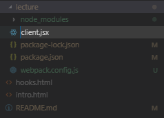

# react-webgame
제로초님 리액트 기초 웹게임 강좌

## 첫 번째 리액트 컴포넌트 생성

```
<!DOCTYPE html>
<html lang="en">
<head>
    <meta charset="UTF-8">
    <meta name="viewport" content="width=device-width, initial-scale=1.0">
    <meta http-equiv="X-UA-Compatible" content="ie=edge">
    <title>first React</title>
    <script crossorigin src="https://unpkg.com/react@16/umd/react.development.js"></script>
    <script crossorigin src="https://unpkg.com/react-dom@16/umd/react-dom.development.js"></script>
</head>
<body>
    <div id="root"></div>

    <script>
        const e = React.createElement;

        // 실행 계획
        class LikeButton extends React.Component {
            constructor(props) {
                super(props);
                this.state = {
                    liked: false,
                }
            }

            render() {
                return e(
                    'button',
                    { onClick: () => {this.setState({ liked: true})} , type: 'submit'}, 
                    this.state.liked === true ? 'Liked' : 'Like',
                );
            }
        }
    </script>

    <script>
        // 실행
        ReactDOM.render(e(LikeButton), document.querySelector('#root'));
    </script>
</body>
</html>
```

## 결과


- 리액트는 프레임워크 같은 라이브러리다.
- CDN 으로 리액트를 바로 사용할 수 있다.


## JSX 와 babel

- 리액트를 사용하기 위해서는 JSX 문법을 사용해야 한다.
- JSX 는 브라우저에서 읽을 수 없으므로 babel 을 통해 자바스크립트 문법으로 변환 후 렌더링 해야한다.


## npm 초기화
- 설치하려는 폴더에서 터미널 실행 (node, npm 이 설치 되어있어야 한다.)

```
npm init
```

- 기재부분 : author, license
- 설치 후 package.json 생김.

## 리엑트 & 리액트 DOM 설치

```
npm i react react-dom
```

## 웹팩 설치하기

```
npm -i -D webpack webpack-cli
```

- 여기서 -D 는 개발할 때만 쓰겠다는 것.

## 웹팩 & 리액트 설정 파일 생성

- webpack-config.js


```
module.exports = {
    
};
```

## 웹펙을 빌드 결과를 저장할 경로 설정


- client.jsx



```
const React = require('react');
const ReactDom = require('react-dom');
```

- index.html 

```
<!DOCTYPE html>
<html lang="ko">
<head>
    <meta charset="UTF-8">
    <title>끝말잇기</title>
</head>
<body>
    <div id="root"></div>
    <script src="./dist/app.js"></script>
</body>
</html>
```

## babel 설치

```
npm i -D @babel/core @babel/plugin-proposal-class-properties @babel/preset-env @babel/preset-react babel-loader
```

- webpack.config.js

```
const path = require('path');  // 현재 경로

module.exports = {
    name: 'wordrelay-setting', // 설정이름
    mode: 'development',       // 모드 
    devtool: 'eval',           // 빠르게
    resolve: {                 // js, jsx 확장자 인식
        extensions: ['.js', '.jsx']
    },

    module: {
        rules: [{
            test: /\.jsx?/,
            loader: 'babel-loader', 
            options: {
                presets: ['@babel/preset-env', '@babel/preset-react'],
                plugins: ['@babel/plugin-proposal-class-properties'],
            },
        }],
    },

    entry: { // 입력
        app: ['./client'],
    },    

    output: {  // 출력
        path: path.join(__dirname, 'dist'),
        filename: 'app.js'
    },

};
```

## 웹팩 빌드

1. npx webpack
2. package.json > scripts 에 등록 시 : npm run dev

```
  "scripts": {
    "dev": "webpack"
  },
```


